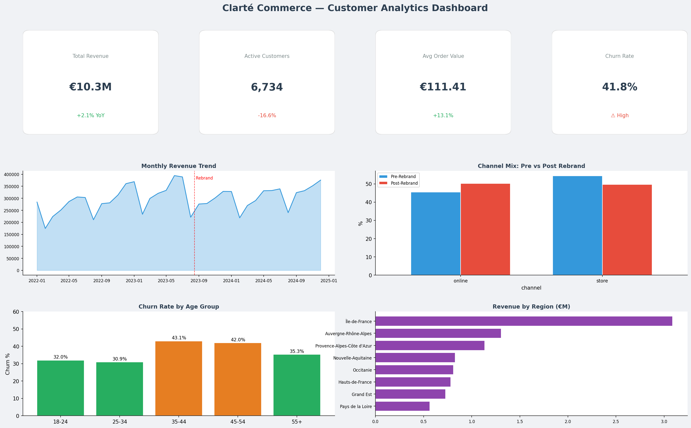
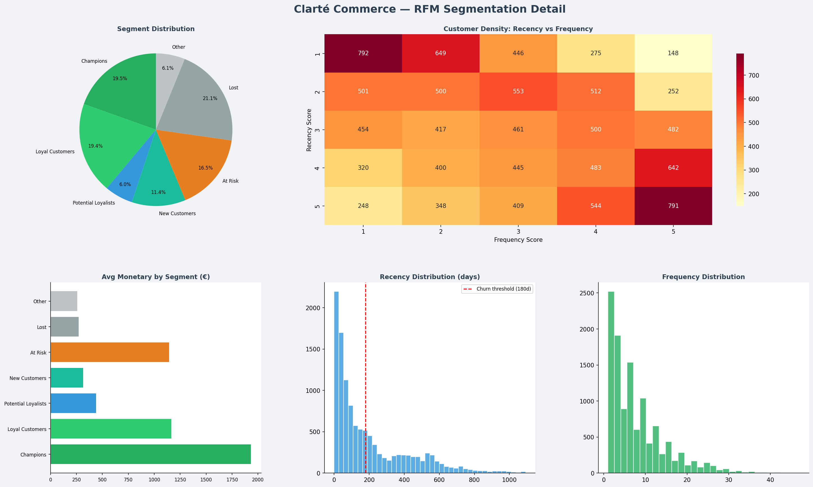

# Clarté Commerce — Customer Segmentation & Churn Analysis

## Project Overview

RFM segmentation and churn pattern analysis for **Clarté Commerce S.A.S.**, a mid-market French fashion retailer (~200 stores + online platform).

In Q3 2023, Clarté underwent a major rebranding, repositioning toward "affordable luxury." Following the rebrand, the company observed an ~18% decline in repeat purchase rates. This project diagnoses the root causes and provides actionable retention recommendations.

**Data scope:** 92,310 transactions | 11,572 customers | 800 SKUs | Jan 2022 – Dec 2024

## Key Findings

- **Revenue down 20.3%** post-rebrand despite AOV increasing by 13.1% (€110 → €125)
- **Champions segment shrank ~23%**, At Risk segment grew ~31%
- **35-44 age group** (core demographic) showed highest churn at 48.5%
- **Store channel lost majority share** (54% → 50%) — lost traffic did not migrate online
- **Silent churn**: 68.6% of churned customers had no email engagement
- **Post-rebrand cohorts retain 6-7pp worse** at every milestone (M1 through M12)

## RFM Segment Summary

| Segment | % of Customers | Avg Revenue | Action |
|---------|---------------|-------------|--------|
| Champions | 12% (-23% post-rebrand) | €380 | Retain — loyalty perks |
| Loyal | 18% | €210 | Upsell — premium tiers |
| At Risk | 31% (+31% post-rebrand) | €145 | Win-back campaign |
| Lost | 24% | €80 | Re-engagement or accept churn |
| New | 15% | €95 | Onboarding flow |

## Repository Structure
```
├── data/
│   ├── raw/                    # Raw transaction, customer, product data
│   ├── processed/              # RFM scores, churn flags, cohort matrix
│   └── sql/                    # Data quality checks, RFM query, cohort query
├── notebooks/
│   ├── 01_eda.ipynb            # Exploratory data analysis
│   ├── 02_rfm_segmentation.ipynb  # RFM scoring and segmentation
│   ├── 03_churn_analysis.ipynb    # Churn patterns and demographics
│   └── 04_cohort_retention.ipynb  # Cohort retention analysis
├── src/
│   ├── data_cleaning.py        # Data loading and cleaning utilities
│   └── rfm_utils.py            # RFM calculation functions
├── reports/
│   ├── executive_summary.md    # Findings and recommendations
│   └── figures/                # Analysis visualizations
└── dashboard/
    └── screenshots/            # Tableau dashboard previews
```

## Dashboard Preview





## Recommendations

1. **Win-back campaign** targeting At Risk segment (35-44, store-channel) — est. €800K-1.2M recoverable
2. **Price sensitivity testing** via A/B tests on key categories
3. **Email re-engagement** campaign for the 68.6% opted-out churned customers
4. **Omnichannel bridge program** — seamless store-to-online experience
5. **Loyalty Program 2.0** with grandfather clauses for existing tiers
6. **Segmented communication** — distinct messaging for pre vs post-rebrand customers

## Stack

- **Python** (pandas, NumPy, seaborn, matplotlib)
- **SQL** (data quality, RFM, cohort queries)

## Author

Nurbol Sultanov — Data Analyst  
[LinkedIn](https://www.linkedin.com/in/nurbolsultanov/) · [GitHub](https://github.com/nurbolsultanov)